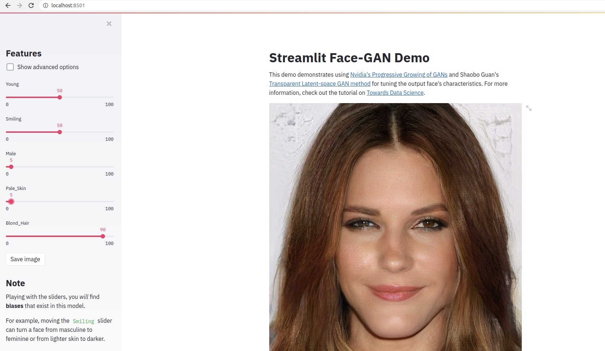
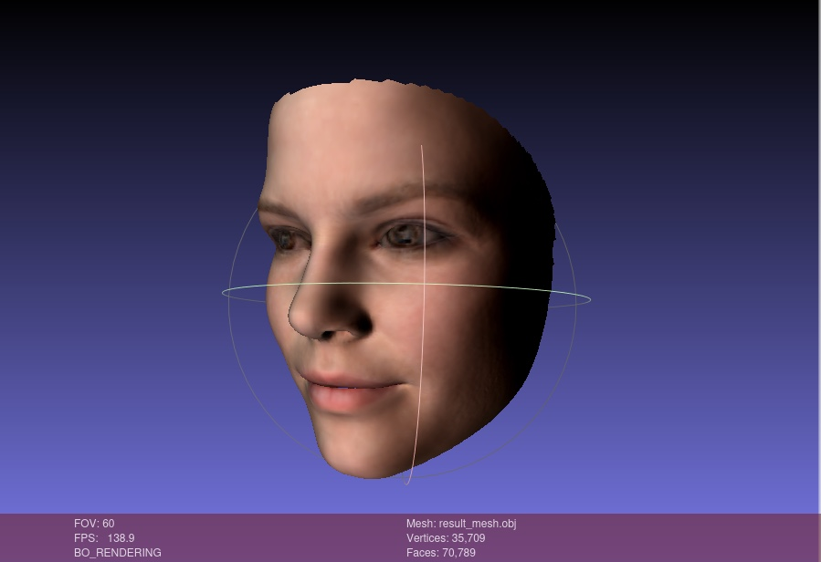
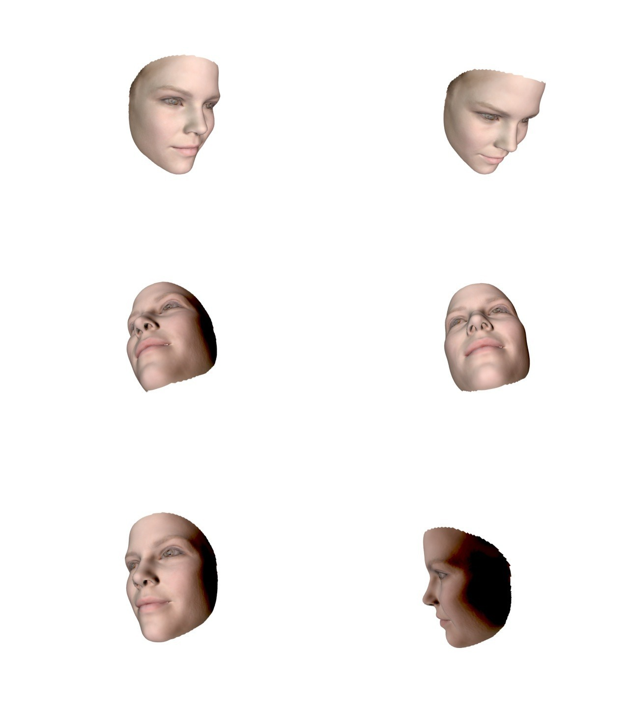

# Generating dataset with 3d faces by attributes
Includes three parts:

1. Generate 2d face image on input attributes (age, smile, etc.).
   [link](https://github.com/streamlit/demo-face-gan)
2. Convert 2d face image to 3d face model.
   [link](https://github.com/microsoft/Deep3DFaceReconstruction/)
3. Put 3d face model and generate dataset of faces with different rotation angles
   [link](https://github.com/microsoft/Deep3DFaceReconstruction/)

# Getting started
## Generate 2d face image
The part requires Python 3.6 or 3.7
1. Install [dlib](https://pypi.org/project/dlib/)
   
2. Install requirements and run app
```
cd face-gan
pip install -r requirements.txt
streamlit run streamlit_app.py
```
3. Generate image and click `Save Image` button. You will get "result.jpg" with face image and
   "result.txt" with five face landmarks.
   


## Generate 3d face model by Deep3DFaceReconstruction

1. Put to root pre-trained network following instructions on 
[Deep3DFaceReconstruction](https://github.com/microsoft/Deep3DFaceReconstruction/tree/15c919c179c449ee87f37c0fa86da7eb6607edac#testing-with-pre-trained-network)
   
2. Put "result.jpg" and "result.txt" from previous stage to `./Deep3DFaceReconstruction/input` and run demo
```
python demo.py
```

3. `./output` subfolder stores reconstruction results

4. Move "result.obj" to root folder

Result in Meshlab:

## Generate dataset

In file `rendering.py` set minimum, maximum and step degrees and run
```
pip install trimesh pyrender
python rendering.py
```
Here is `dataset` folder with results.

Example:
